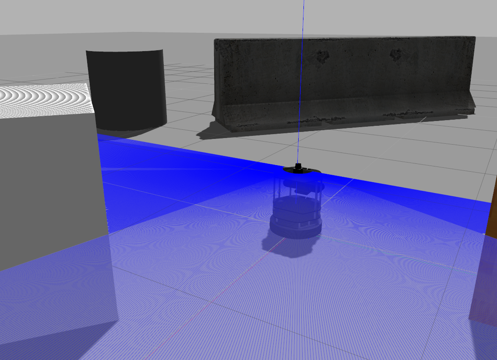
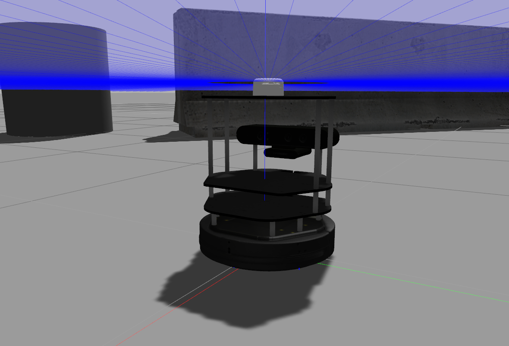

# turtlebot_lidar #

ROS Kinetic package for adding a 2D Lidar into the Gazebo simulation of a Turtlebot 2 robot. 

The simulated robot includes a Kobuki base, an Orbec Astra RGBD camera and a Hokuyo or RPLidar A2M8 Lidar

| Turtlebot 2 with Hokuyo Lidar   | Turtlebot 2 with RPLidar A2M8    |
| ------------------------------- | -------------------------------- |
|  |   |


## Installation ## 

Clone the package into your catkin workspace:

```sh
cd [catkin_workspace]/src
git clone https://github.com/diegomrt/turtlebot_lidar.git
cd ..
catkin_make
source devel/setup.bash
```

## Usage ## 
### Turtlebot 2 with Hokuyo Lidar ### 

After installing, to launch the version with Hokuyo lidar, run:

```sh
roslaunch turtlebot_lidar turtlebot_hokuyo.launch  
```
The simulated characteristics of the Hokuyo lidar are:
* Min range: 10 cm 
* Max range: 30 m
* Min angle: -90º
* Max angle: +90º
* Samples: 720
* Freq: 40 Hz

### Turtlebot 2 with RPLidar A2M8 ### 

After installing, to launch the version with RPLidar A2, run:

```sh
roslaunch turtlebot_lidar turtlebot_rplidar.launch  
```
The simulated characteristics of the RPLidar A2M8 lidar are:
* Min range: 15 cm 
* Max range: 8 m
* Min angle: -180º
* Max angle: +180º
* Samples: 400 (0.9º/sample)
* Freq: 10 Hz (4000 samples/s)


